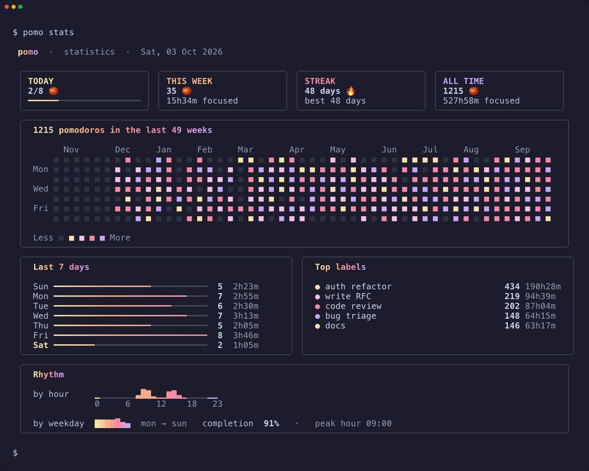
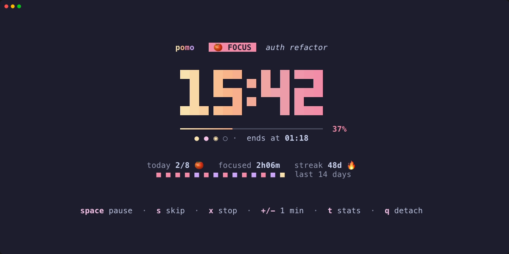
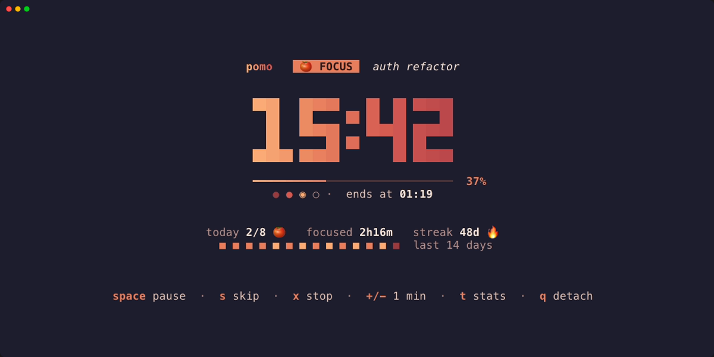
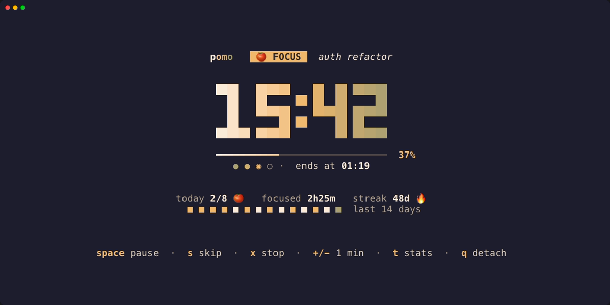
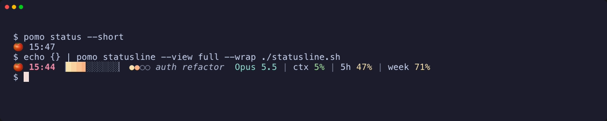

<div align="center">

# pomo 🍅

**A colorful pomodoro timer for the terminal, and for the coding agents that live there.**

A big gradient clock, a GitHub-style heatmap of your focus, a live countdown in
Claude Code's status line, and a scriptable CLI that Claude Code and Codex can drive.

[](https://go.dev)
[](#install)
[](LICENSE)


</div>

## Features

- **A clock you can see from across the room.** Full-screen gradient digits, a progress bar, cycle dots, and today's tally.
- **Stats worth looking at.** A year-long heatmap, streaks, the last 7 days, top labels, and your hourly and weekday rhythm.
- **One timer per machine.** Start it in a terminal, in Claude Code or in Codex. Every view joins the same running session.
- **Lives where you work.** A status-line segment for Claude Code, a `/pomo` slash command, a Codex prompt, cmux sidebar pills, and `pomo status --short` for tmux or starship.
- **Breathe while the agent thinks.** Guided breathing fills the 10–60 s waits while an agent works.
- **Scriptable.** Every command speaks `--json`, and it's a single static Go binary with no runtime dependencies.

## Install

Requires Go 1.26+ on macOS or Linux.

```sh
go install github.com/antrvan746/pomodoro-cli/cmd/pomo@latest
```

Or from a clone:

```sh
git clone https://github.com/antrvan746/pomodoro-cli && cd pomodoro-cli
make install      # → $(go env GOPATH)/bin/pomo
```

## Quick start

```sh
pomo                          # full-screen timer (attaches if one is running)
pomo start 50 write the RFC   # 50-minute focus session with a label
pomo start --break            # short break   (--long for a long break)
pomo stats                    # dashboard + heatmap
pomo log                      # recent sessions
pomo status --short           # "🍅 12:34", for tmux / starship
```

The cycle is focus → short break, with a long break after every 4th pomodoro.
When a phase ends you get a desktop notification, even if you closed the
terminal. `pomo watch` reopens the clock.

### Timer keys

| key | action | | key | action |
| --- | --- | --- | --- | --- |
| `enter` | start the next phase | | `+` / `-` | add / remove a minute |
| `space` / `p` | pause / resume | | `l` | set a label |
| `s` | skip to the next phase | | `t` | toggle statistics |
| `x` | stop | | `c` | cycle colour theme |
| `q` | detach (the timer keeps running) | | | |

## Statistics

`pomo stats` (or `t` in the timer) shows today against your daily goal, this week,
your current and best streak, all-time totals, up to 53 weeks of history, your top
labels, and when you focus best.



## Themes

```sh
pomo theme            # list themes with swatches
pomo theme ember      # switch (or press c in the timer)
POMO_THEME=sand pomo  # override for one run
```

| `catppuccin` *(default)* | `ember` | `sand` |
| --- | --- | --- |
|  |  |  |
| Mocha on dark terminals, Latte on light ones | peach, coral and brick red | cream, mustard and olive |

`mocha` and `latte` force a Catppuccin flavour. Each theme sets every colour role,
including text, muted text, tracks and the heatmap, not just the accents.

## Claude Code

### 1. The `/pomo` command

Inside Claude Code:

```text
/plugin marketplace add antrvan746/pomodoro-cli
/plugin install pomo@pomo
```

```text
/pomo start 50 auth refactor     # 50-minute focus with a label
/pomo pause    /pomo resume    /pomo stop    /pomo skip
/pomo break    /pomo long      /pomo extend 5
/pomo status   /pomo stats     /pomo log     /pomo theme sand
```

The command runs `pomo` directly and prints its output, with no model round-trip in
between. The plugin also ships a skill, so plain requests like *"start a pomodoro
for the auth refactor"* work too. New sessions are told about a running timer when
they open.

**The big clock opens by itself.** When an agent starts a timer, pomo opens the
full-screen clock in a pane next to you: a split in cmux, tmux, WezTerm or kitty, or a
new iTerm, Terminal or Ghostty window. It never opens a second clock in a workspace
that already shows one. `q` closes the pane and the timer keeps running. Turn it off
with `pomo config set open_clock never`, or skip it once with `--no-open`.

### 2. A live countdown in the status line

```sh
pomo setup claude
```



Your existing status-line command is **wrapped, not replaced**. A backup of
`settings.json` is written first, and `pomo setup claude --uninstall` restores exactly
what was there. The segment disappears when no timer is running.

- `pomo config set statusline_view full` switches the view: `minimal`, `classic`, or `full` (adds the label).
- `POMO_HIDE=1` hides it in one shell.

## Codex

```sh
pomo setup codex     # prompts/pomo.md, the pomo skill and the breathing hooks
```

Then in Codex: `/prompts:pomo start 25 write tests`, or just ask it to start a
pomodoro. Codex asks you to trust the two new hooks the first time.
`pomo setup codex --uninstall` removes all of it and leaves your other hooks alone.

## cmux

With [cmux](https://cmux.com), pomo shows up with no setup:

- **Sidebar pill:** a live `🍅 12:34 · label` countdown on every workspace. It turns `☕` on breaks and `⏸` when paused.
- **Notifications:** when a phase ends, cmux gets the notification and the workspace it started from gets an unread badge. It replaces the macOS banner, so you don't get two.
- **Clock pane:** an agent's `/pomo start` opens the big clock in a split.

Turn it off with `pomo config set cmux false`.

## Breathe while the agent works

Every prompt gives you 10 to 60+ seconds of waiting. pomo turns that into a guided
breathing exercise (ported from [Mindful-Claude](https://github.com/halluton/Mindful-Claude)).

- **Claude Code:** the plugin draws the breath above the prompt and the spinner counts with you, and it's gone when Claude answers. It's a Claude Code mod, so enable function hooks in `~/.claude/settings.json` with `"env": { "CLAUDE_CODE_ENABLE_FUNCTION_HOOKS": "1" }`. Tune it with `/breathe` (`off`, `hrv`, `sigh`, `box`, `478`, `style wave`, `delay 5`).
- **Codex:** Codex can't draw above its prompt, so the hooks from `pomo setup codex` open a small pane below it (cmux, tmux, WezTerm or kitty) after `delay` seconds and close it when Codex answers. Tune it with `pomo breathe …`.
- **Anywhere:** `pomo breathe` shows the exercise until `q` (`n` next exercise, `s` style).

| exercise | pattern | best for |
| --- | --- | --- |
| `hrv` Coherent breathing | 5.5 s in, 5.5 s out | sustained HRV improvement |
| `sigh` Physiological sigh | double inhale, long exhale | a quick calm-down |
| `box` Box breathing | 4 s in, 4 s hold, 4 s out, 4 s hold | focus |
| `478` 4-7-8 breathing | 4 s in, 7 s hold, 8 s out | deep relaxation |

## Scripting

Every command takes `--json`. Without a TTY, `pomo start` runs in the background
automatically, so agents and scripts never get stuck in the full-screen UI. Each
session records who started it (`cli`, `tui`, `claude`, `codex`).

```sh
pomo start 50 "auth refactor" --json
pomo status --json
pomo stats --json --weeks 4
```

## Configuration

```sh
pomo config                       # show settings
pomo config set focus 50          # minutes
pomo config set daily_goal 6
pomo config set auto_start_break false
```

| key | default | |
| --- | --- | --- |
| `focus` / `short_break` / `long_break` | `25` / `5` / `15` | minutes |
| `long_break_every` | `4` | pomodoros per cycle |
| `daily_goal` | `8` | |
| `auto_start_break` / `auto_start_focus` | `true` / `false` | roll into the next phase with no window open |
| `notify` / `sound` | `true` | desktop notification and chime when a phase ends |
| `theme` | `catppuccin` | see [Themes](#themes) |
| `statusline_view` | `classic` | `minimal`, `classic`, `full` |
| `cmux` | `true` | sidebar pill and notifications |
| `open_clock` | `auto` | `auto` (only when an agent starts it), `always`, `never` |

Data lives in `~/.local/share/pomo/` (or `$XDG_DATA_HOME/pomo`, or `$POMO_HOME`):

- `sessions.jsonl` is the append-only history.
- `active.json` is the running session.
- `config.json` holds your settings.

## Development

```sh
make build    # ./bin/pomo
make test     # go test ./...
```

```text
cmd/pomo/          entry point
internal/cli/      cobra commands, setup claude / codex
internal/ui/       Bubble Tea timer, big clock, stats view, themes, status line
internal/store/    sessions, active timer, config (file-locked JSON)
internal/stats/    streaks, heatmap, rhythm
internal/daemon/   background watcher that ends phases and notifies
internal/breath/   breathing exercises
plugin/            Claude Code plugin: /pomo, skill, status line and breathing hooks
```

Built with [Bubble Tea](https://github.com/charmbracelet/bubbletea) and
[Lip Gloss](https://github.com/charmbracelet/lipgloss).

## Credits

- Breathing exercises are ported from [Mindful-Claude](https://github.com/halluton/Mindful-Claude) (MIT).
- Default palette from [Catppuccin](https://catppuccin.com).

## License

[MIT](LICENSE) © An Tran Van
